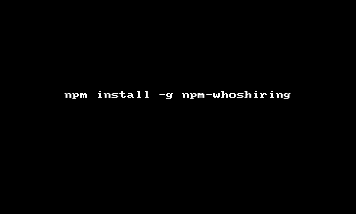

# node-npm-whoshiring [](https://travis-ci.org/hemanth/node-npm-whoshiring)

> Shows a table of currently open jobs listed in npm.com.

## Install

```sh
$ npm install --save npm-whoshiring
```

## Usage

##### Node.js

```js
whosHiring(function(err, jobs) {
// Rest of your logic to play with jobs.
});
```

##### CLI

```sh
$ npm install --global npm-whoshiring
```

__GIF FTW:__



## License

MIT © [Hemanth.HM](http://h3manth.com)
